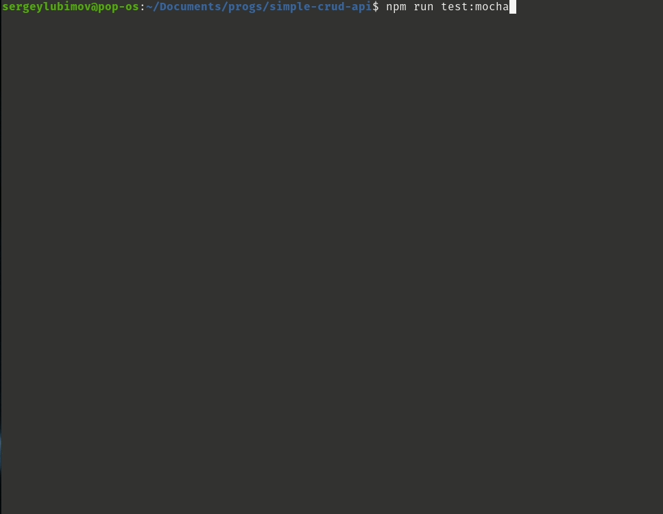
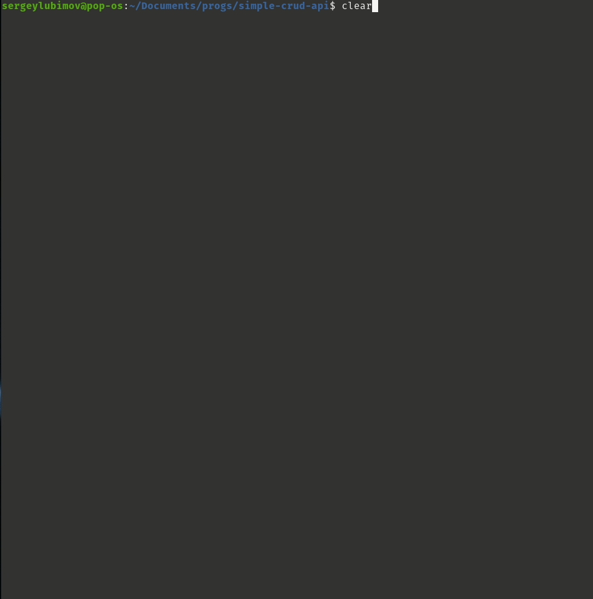

# __Task 3. Simple CRUD API__

Task [description here](https://github.com/rolling-scopes-school/basic-nodejs-course/blob/master/descriptions/simple-crud-api.md)

Task due date / deadline date - 28.11.21 / 28.11.21 23:59(GMT+3)

Self check:
 
 TOTAL POINTS - _** 162 points**_

-----------

# Task

Your task is to implement simple CRUD API using in-memory database underneath.  
NB! You must create new repository for this task. Its name must be `simple-crud-api` i.e. full link to the repository must be `https://github.com/%your-gihub-id%/simple-crud-api`.

## Details:

1. The task must be solved using only **pure Node.js**. Any libraries and packages (except `nodemon`, `eslint` and its plugins, `prettier` and its plugins, `uuid`, `webpack` and its plugins, testing tools, `dotenv`, `cross-env`) **are prohibited**.
2. API path `/person`:
    * **GET** `/person` or `/person/${personId}` should return all persons or person with corresponding `personId`
    * **POST** `/person` is used to create record about new person and store it in database
    * **PUT** `/person/${personId}` is used to update record about existing person
    * **DELETE** `/person/${personId}` is used to delete record about existing person from database
3. Persons are stored as `objects` that have following properties:
    * `id` — unique identifier (`string`, `uuid`) generated on server side
    * `name` — person's name (`string`, **required**)
    * `age` — person's age (`number`, **required**)
    * `hobbies` — person's hobbies (`array` of `strings` or empty `array`, **required**)
4. Requests to non-existing endpoints (e.g. `/some-non/existing/resource`) should be handled.
5. Internal server errors should be handled and processed correctly.
6. Value of port on which application is running should be stored in `.env` file.
7. There should be 2 modes of running application: **development** and **production**
8. There could be some tests for API.

-----------

# __Evaluation criteria__

## Базовая реализация

1. В репозитории с приложением имеется файл `Readme.md`, содержащий подробные инструкции по установке, запуску и использованию приложения **плюс 10 баллов**
2. Сервер возвращает соответствующие ответы на запросы:
* **GET** `/person`:
    * Сервер возвращает статус код 200 и все записи **плюс 6 баллов**
* **GET** `/person/{personId}`:
    * Сервер возвращает статус код 200 и запись с `id === personId`, если такая запись есть **плюс 10 баллов**
    * Сервер возвращает статус код 400 и соответствующее сообщение, если `personId` невалиден (не `uuid`) **плюс 6 баллов**
    * Сервер возвращает статус код 404 и соответствующее сообщение, если запись с `id === personId` не найдена **плюс 6 баллов**
* **POST** `/person`
    * Сервер возвращает статус код 201 и свежесозданную запись **плюс 10 баллов**
    * Сервер возвращает статус код 400 и соответствующее сообщение, если тело запроса не содержит обязательных полей **плюс 6 баллов**
* **PUT** `/person/{personId}`
    * Сервер возвращает статус код 200 и обновленную запись **плюс 10 баллов**
    * Сервер возвращает статус код 400 и соответствующее сообщение, если `personId` невалиден (не `uuid`) **плюс 6 баллов**
    * Сервер возвращает статус код 404 и соответствующее сообщение, если запись с `id === personId` не найдена **плюс 6 баллов**
* **DELETE** `/person/{personId}`
    * Сервер возвращает статус код 204 и соответствующее сообщение, если запись найдена и удалена **плюс 10 баллов**
    * Сервер возвращает статус код 400 и соответствующее сообщение, если `personId` невалиден (не `uuid`) **плюс 6 баллов**
    * Сервер возвращает статус код 404 и соответствующее сообщение, если запись с `id === personId` не найдена **плюс 6 баллов**

## Продвинутая реализация:

*  Ошибки, возникающие при обработке запроса на `/pesron` корректно обрабатываются и в случае их возникновения API возвращает статус код 500 с соответствующим сообщением **плюс 10 баллов**
*  Запросы на несуществующие ресурсы (например, `/some/non/existing/resource`) корректно обрабатываются (возвращается human friendly сообщение и 404 статус код) **плюс 6 баллов**
*  Приложение запускается в development-режиме при помощи `nodemon` (имеется `npm` скрипт `start:dev`) **плюс 6 баллов**
*  Приложение запускается в production-режиме при помощи `webpack` (имеется `npm` скрипт `start:prod`, который запускает процесс сборки webpack и после этого запускает файл с билдом) **плюс 6 баллов**
*  Значение `PORT` хранится в `.env` файле **плюс 6 баллов**

## Hacker scope

* Имеются E2E тесты, покрывающие логику приложения (не меньше 3 различных сценариев) **плюс 30 баллов**
Пример сценария:
1. GET-запросом получаем все объекты (ожидается пустой массив)
2. POST-запросом создается новый объект (ожидается ответ, содержащий свежесозданный объект)
3. GET-запросом пытаемся получить созданный объект по его `id` (ожидается созданный объект)
4. PUT-запросом пытаемся обновить созданный объект (ожидается ответ, содержащий обновленный объект с тем же `id`)
5. DELETE-запросом удаляем созданный объект по `id` (ожидается подтверждение успешного удаления)
6. GET-запросом пытаемся получить удаленный объект по `id` (ожидается ответ, что такого объекта нет)

## Штрафы

* Полная ссылка на репозиторий с решением отличается от `https://github.com/%your-github-id%/simple-crud-api` **минус 100 баллов**
* Использование любых пакетов, библиотек, фреймворков кроме `nodemon`, `dotenv`, `cross-env`, `eslint` и его плагинов, `webpack` и его плагинов, `uuid`, а также библиотек, используемых для тестирования **минус 130 баллов** 
* Имеются коммиты после дедлайна, за исключением коммитов, изменяющих исключительно `Readme.md` либо вспомогательные файлы (`.gitignore`, `.prettierrc.json` и т.д.) **минус 30% от максимального балла за задание (минус 49 баллов)**
* Отсутствует PR либо его описание некорректно (отсутствуют либо некорректен любой из 3 обязательных пунктов) **минус 20 баллов**
* Отсутствует отдельная ветка для разработки **минус 20 баллов**
* Меньше 3 коммитов в ветке разработки, не считая коммиты, вносящие изменения только в `Readme.md` либо вспомогательные файлы (`.gitignore`, `.prettierrc.json` и т.д.) **минус 20 баллов**

[summaru report](#summary-report)

------------

# __Summary Report__

Задание выполнено полностью.

## Пример валидного запроса 

```
{
    "id": "89da7309-e5ed-48a4-b4e6-ae47c947ae12",
    "name" : "Test Product",
    "age": "45", 
    "hobbies" : "['TEST1','PROD1','test']",
}


```

__ Обращаю внимание что передаются строки! И это не является основанием для снятия баллов__
Данный вопрос обсуждался на стриме : https://www.youtube.com/watch?v=ogCL5c8bhUQ

----

Для тестирования 500 ошибки, [раскомментировать тестового пользователя](https://github.com/SeLub/simple-crud-api/blob/develop/personsDB.js) в файле "базы данных" = undefined и запросами из Postman проверьте получение 500 ответа. 

----

## Проверка 500 ошибки


Для запуска приложения скопируйте все команды сразу и вкиньте их в терминал.
Сервер запустится на порту 3000:

```
git clone https://github.com/SeLub/simple-crud-api.git

cd simple-crud-api

git checkout develop

npm install

npm run server

```

После этого можно запустить ваш Postman и протестировать работу.

Для вашего удобства проверки в Postman, я экспортировал коллекцию API использовавшихся для разработки и тестирования сервера. Она находится в папке 
[__postman_collection__](https://github.com/SeLub/simple-crud-api/tree/develop/postman_collection). Можете импортировать в свой Postman.

Вы можете [раскомментировать тестового пользователя](https://github.com/SeLub/simple-crud-api/blob/develop/personsDB.js) в файле "базы данных" и запросами из Postman проверить работу моей коллекции. 


Для тестирования используются два фреймворка : __Jest__ , __Mocha__ и библиотека __Chai__.

## Предпочтительный фреймворк для тестирования: __Mocha__

Перед тестами остановите сервер командой _Ctrl-C_!

Запускать командой 

```
npm run test:mocha

```
_Внимание! Некоторые тесты могут не пройти с первого раза в Jest (связано с перезапуском сервера после перехода между файлами тестов). Если так случится попробуйте ещё раз. Как правило со второго, третьего раза тесты Jest проходят все. При оценке ориентируйте на тесты __Mocha__. Они работают безотказно. __Jest__ я использовал чисто как эксперимент._

Также можно запустить тестирование __Jest__ :

```
npm run test:jest

```

# Я уложился в дедлайн и коммиты после него делать не буду.

Оставляю за собой право на коммит по исправлению и дополнению отчёта после дедлайна (так можно!).

Команды для запуска и управления можно найти ниже. 

Также в отчёте приведены скриншоты тестов.

------------

## Server management

№ | Command | Description 
----------------------|-------------|-----
1 | npm run server | Start server
2 | npm run start:dev | Automatically restart server when code has edited
3 | npm run start:prod | Generate production build wth webpack and start it
4 | npm run test:mocha | Run mocha tests
5 | npm run test:jest | Run jest tests

-----

## Screenshots 

------------

#### **Mocha Tests** - результат тестирования фреймворком Mocha



#### **Тесты Jest** - результат тестирования фреймворком Jest


